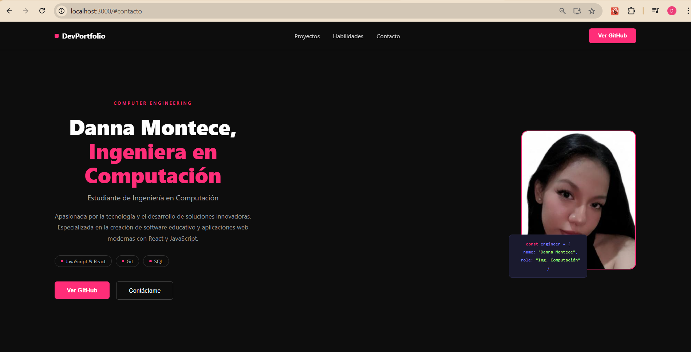

# 🌐 Portafolio — Danna Montece

> Sitio web personal desarrollado con **React** para mostrar mi trayectoria, habilidades y proyectos como estudiante de Ingeniería en Computación.

🔗 **Demo en vivo:** [portafolio-cv-2026.dmontece.workers.dev/](https://portafolio-cv-2026.dmontece.workers.dev/)  
📁 **Repositorio:** [github.com/Danna0327/Portafolio-CV.github.io](https://github.com/Danna0327/Portafolio-CV.github.io)

---

## ✨ Vista previa



---

## 📋 Contenido

- [Sobre el proyecto](#sobre-el-proyecto)
- [Tecnologías](#tecnologías)
- [Secciones](#secciones)
- [Instalación](#instalación)
- [Despliegue](#despliegue)
- [Contacto](#contacto)

---

## 📌 Sobre el proyecto

Este portafolio fue construido desde cero usando **React** como parte de mi formación en Ingeniería en Computación en la Universidad Politécnica Salesiana. El objetivo es mostrar mis habilidades técnicas, proyectos académicos y facilitar el contacto profesional.

**Características:**
- ⚡ Diseño oscuro moderno con efectos neon
- 🎨 Paleta de color rosa `#ff0080` sobre fondo `#101e22`
- 📱 Layout responsive con CSS Grid
- 🔗 Links directos a repos de GitHub
- 📬 Formulario de contacto funcional
- ✨ Animaciones CSS (pulse glow, hover effects)
- 🔤 Tipografía Inter + Material Symbols

---

## 🛠️ Tecnologías

| Tecnología | Uso |
|---|---|
| **React 19** | Framework principal |
| **JavaScript ES6+** | Lógica y componentes |
| **CSS-in-JS** | Estilos en línea por componente |
| **Google Fonts** | Tipografía Inter |
| **Material Symbols** | Iconografía |
| **Git & GitHub** | Control de versiones |
| **Netlify** | Despliegue y CI/CD |

---

## 📂 Estructura del proyecto

```
portafolio-cv/
├── public/
├── src/
│   ├── Componentes/
│   │   ├── BarraNavegacion.js
│   │   ├── Inicio.js
│   │   ├── SobreMi.js
│   │   ├── Proyectos.js
│   │   ├── Habilidades.js
│   │   └── Contacto.js
│   ├── Recursos/
│   │   ├── Perfil.jpg
│   │   └── Imagenes-Proyectos/
│   │       ├── mathspin.png
│   │       └── proyecto-web.png
│   ├── App.js
│   ├── App.css
│   └── index.js
├── package.json
└── README.md
```

---

## 📑 Secciones

| Sección | Descripción |
|---|---|
| **Inicio** | Presentación principal con foto y código decorativo |
| **Sobre mí** | Descripción personal y valores fundamentales |
| **Educación** | Universidad Politécnica Salesiana — Ing. Computación |
| **Experiencia** | Asistente de Investigación Académica |
| **Proyectos** | MathSpin, TIC-InnovaEdu, Portafolio React |
| **Habilidades** | HTML/CSS, JavaScript, React, SQL, Git, Figma |
| **Contacto** | Formulario + email + GitHub |

---


La app abrirá en [http://localhost:3000](http://localhost:3000)

---

## 🌍 Despliegue

El proyecto está desplegado automáticamente en **Netlify** con CI/CD conectado a este repositorio. Cada `git push` a `main` genera un nuevo deploy.


## 📬 Contacto

**Danna Montece**  
✉️ [montecedanna024@gmail.com](mailto:montecedanna024@gmail.com)  
🐙 [github.com/Danna0327](https://github.com/Danna0327)

---

<div align="center">

© 2026 Danna Montece · Todos los derechos reservados

</div>
